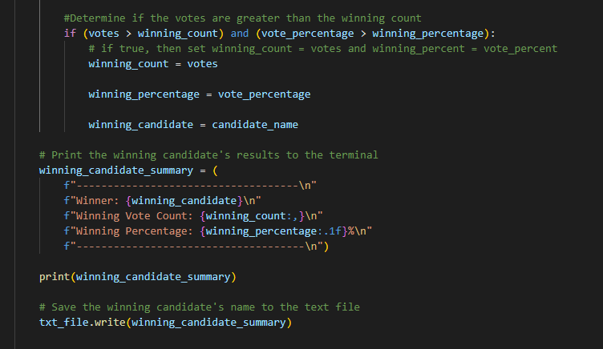

# Election_Analysis
---
## Project Overview
This project's focus was to complete an election audit for the Colorado Board of Elections, so that they can discuss the results. Using Python's tools, the data will be filtered down into information that is cohesive and ledgeable.

---
## Resources
- Data Source: [election_results.csv](Resources/election_results.csv)
- Software: Python 3.9.12, Visual Studio Code 1.71.2
- Python Code: [pypoll.py](pypoll.py)
---
## Summary
The analysis of the election show that: 
- There were 369,711 votes case in the election.
- The candidates were:
    - Charles Casper Stockham
    - Diana DeGette
    - Raymon Anthony Doane
- The candidate results were:
    - Charles Casper Stockham received 23% of the vote and 85,213 number of votes.
    - Diana Degette received 73.8% of the vote and 272,892 number of votes.
    - Raymon Anthony Doane received 3.1% of the vote and 11,606 number of votes.
- The winner of the election was:
    - Diana DeGette, who received 73.8% of the vote and 272,892 number of votes.

Code Output
File Resource: [election_analysis.txt](Resources/election_results.csv)
```
Election Results
-------------------------
Total Votes: 369,711
-------------------------
Charles Casper Stockham: 23.0% (85,213)
Diana DeGette: 73.8% (272,892)
Raymon Anthony Doane: 3.1% (11,606)
------------------------------------
Winner: Diana DeGette
Winning Vote Count: 272,892
Winning Percentage: 73.8%
-------------------------------------
```

---
## Challenge Overview
By using tools in Python and with the direction provided by Tom and Seth, the data was filtered down into the following for the Colorado Board of Elections:
1. Calculate the total number of votes.
2. Get a complete list of candidates who received votes.
3. Calculate the total number of votes each candidate received.
4. Calculate the percentage of votes each candidate won.
5. Determine the winner of the election based on popular vote.

---
## Challenge Summary
1. Calculate the total number of votes.
-  In Python, I used the with open () funtion to access the election csv data file. Then to count up all the votes, an accumulator variable needs to be initialized (total_votes) and set to zero.
- Lastly, using the print () function, run the code for total_votes.(Fg. 1)
2. Get a complete list of candidates who received votes.
- By applying the rows function and intializing candidate_options to zero, I was able to add the candidate_name to candidate_options list by using the append() function and successfully pull the candidates names who received votes. Then print() the candidate_options. (Fg. 1)
```
# Open the election results and read the file.
with open(file_to_load) as election_data:

    # Read the file object with the reader function
    file_reader = csv.reader(election_data)

    # Print the header row
    headers = next(file_reader)

    # Print each row in the CSV file.
    for row in file_reader:

        # Add to the total vote count. standard is number = number + 1, which is then augmented to number +=1
        total_votes +=1

        # Print the candidate name for each row
        candidate_name = row[2]

```

Output #1 and #2
```
 Total Votes: 369,711
 List of candidates who received votes
     ['Charles Casper Stockham', 'Diana Degette', 'Raymon Anthony Doane']
```
3. Calculate the total number of votes each candidate received.
- Using an if statement within the for loop, I was able to get a complete list of candidates who received votes and list them out in the output.

```
     #If the candidate does not match any existing candidate...
        if candidate_name not in candidate_options:

            #Add it to the list of candidates
            candidate_options.append(candidate_name)

            # Begin tracking that candidate's vote count.
            candidate_votes[candidate_name] = 0

        # Add a vote to that candidate's count.
        candidate_votes[candidate_name] +=1
```

4. Calculate the percentage of votes each candidate won.
```
# Determine the percentage of votes for each candidate by looping through the counts.
    # Iterate through the candidate list.
    for candidate_name in candidate_votes:
        
        # Retrieve vote count of a candidate.
        votes = candidate_votes[candidate_name]

        # Calculate the percentage of votes.
        vote_percentage = float(votes) / float(total_votes)*100
        
        # To do: print out the winning candidate, vote count and percentage to terminal
        # print(f"{candidate_name}: {vote_percentage:.1f}% ({votes:,})\n")
        candidate_results = (f"{candidate_name}: {vote_percentage:.1f}% ({votes:,})\n")

        # Print each candidate, their voter count, and percentage to the terminal
        print(candidate_results)
```
- After everything was said and done, I put together a winning candidate summary to list out the final results and then insert them into a txt file for Tom and Seth.


